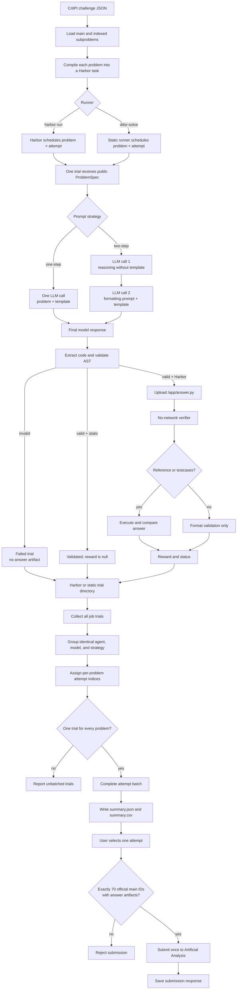

# Evaluation pipeline

`ddsr-solve` stops after code extraction and static AST validation. Harbor adds
container isolation and, when verifier data exists, answer execution and comparison.

| Mode | Entry point | Code execution | Result |
| --- | --- | --- | --- |
| Harbor | [`CritPtAgent.run`](ddsr_bench/benchmarks/critpt/harbor.py) | When a reference or testcases exist | Reward and status |
| Static | [`run_trial`](ddsr_bench/benchmarks/critpt/static.py) | None | Validation status; reward is `null` |

Both modes use the same prepared tasks, model clients, prompts, generation
runner, answer extraction, and AST validation. Only Harbor continues into the
container verifier.

A trial is one complete evaluation of one problem for one attempt. A two-step
trial contains two model calls but still produces one answer and one trial
result. Concurrency changes how many trials run simultaneously, not how trials
are grouped into submission attempts.
