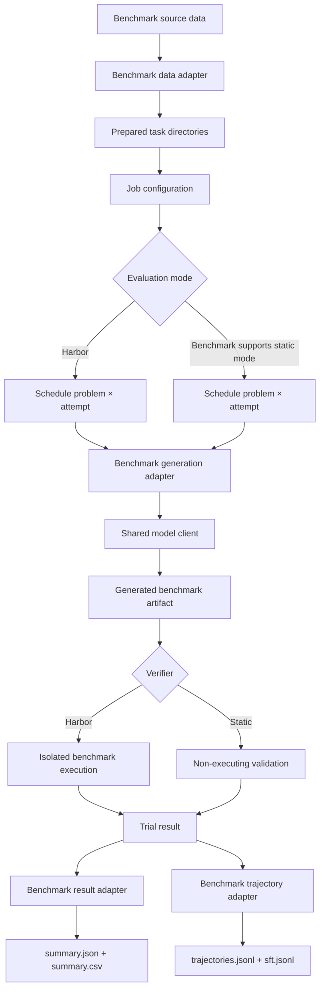

# Framework pipeline

Every benchmark supplies adapters for its source data, generation policy,
verifier, result records, and trajectories. The shared framework supplies model
clients, job configuration, collection, and training-data export.

A trial is one evaluation of one problem for one attempt. Concurrency controls
how many trials run at once; it does not combine them or cause their files to
share a directory.

The benchmark pipelines define what one generated artifact contains and how it
is verified:

- [CritPt pipeline](ddsr_bench/benchmarks/critpt/PIPELINE.md)
- [SciCode pipeline](ddsr_bench/benchmarks/scicode/PIPELINE.md)
