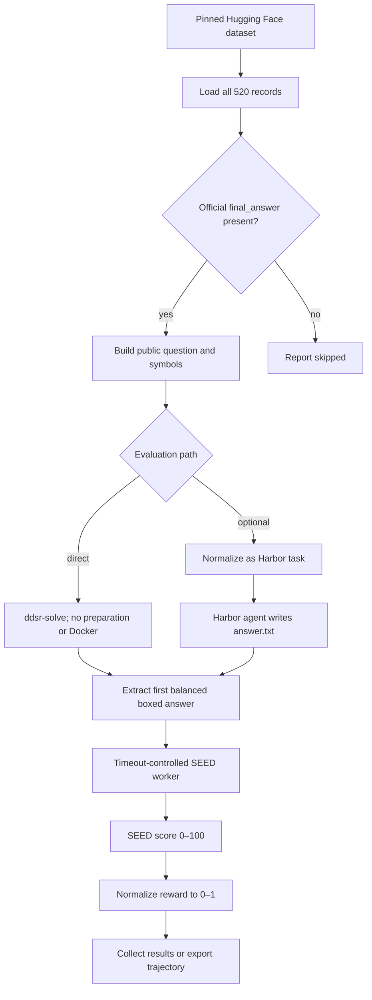

# CMPhysBench pipeline

CMPhysBench is a text-scoring benchmark. Direct static evaluation is preferred
because the model output is never executed. Optional Harbor normalization is
available for consistency with execution-based benchmarks.

One trial is one problem-attempt pair. Concurrency schedules independent trials
without changing attempt grouping. Missing or malformed boxed answers receive
zero; the evaluator never sends a repair prompt.

SEED supports Expression, Equation, Tuple, Interval, and Numeric answers. The
adapted implementation preserves the official symbolic equivalence, tree-edit
partial credit, tuple recursion, interval handling, and numeric tolerances.
