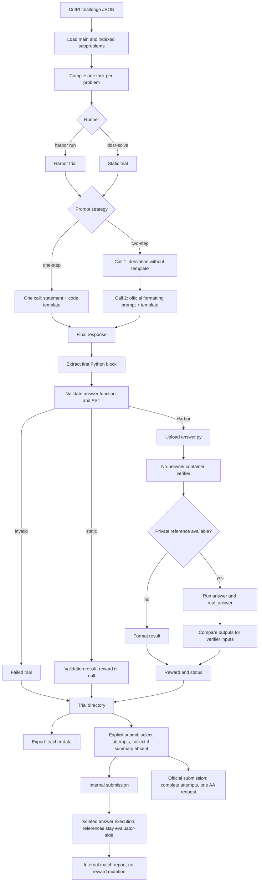

# CritPt pipeline

One CritPt challenge contains a main problem and may contain ordered,
independently indexed subproblems. Preparation compiles each problem into its
own task so Harbor can schedule problems and attempts independently.

Prepared job runs generate every problem as an independent trial. The lower-level
challenge conversation API additionally supports carrying prior subproblem
history forward or generating subproblems independently. One-step uses one model
call per problem; two-step uses two calls but still produces one artifact and
one trial result.

Static concurrency refills free slots as trials finish. Each stage saves a
checkpoint and optional stream journal. The second stage still runs when the
first-stage content is empty or truncated unless strict stage checks are
explicitly enabled. Consensus uses the same original AST validator and never
recovers code from reasoning-only responses.

Official public challenges do not expose reference answers or testcases, so
their local Harbor result is format validation. Reference execution is used
only when verifier-side answer data is available. Submission is a separate,
explicit action for one or more selected attempts. Both backends collect completed
generation results when the summary is absent and reuse an existing summary unchanged.
Official submission sends all selected complete attempts in one AA request.
Internal submission reads artifact paths from the selected collected batches,
reuses one reference cache across sequential attempts, and reports their aggregate
means. Problems within each attempt run concurrently; missing active answers count
as zero. Only the official backend requires all 70 main IDs and answer artifacts
per attempt.
Docker worker lifecycle and resource enforcement use Harbor environments with
the shared CritPt image. Consensus owns grading concurrency and scoring;
each worker receives only its own request, without host reference mounts.
Internal submit is verification, not another generation/agent trial. Successful
reference outputs may be cached across attempts; answers and comparisons run afresh.

See the [CritPt guide](README.md) for commands and data setup.

The current CritPt consensus policy scores 61 of 70 main problems. Nine skipped
problems, including audited exclusions 47 and 51, retain per-attempt records and
are omitted from score denominators; generation still covers all requested tasks.
