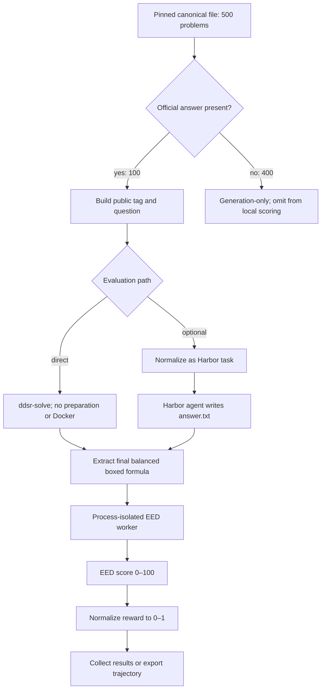

# PHYBench pipeline

PHYBench is a text-scoring benchmark. Direct static evaluation is preferred;
optional Harbor normalization provides the same task and artifact boundaries as
the other supported benchmarks.

One trial is one problem-attempt pair. Concurrency schedules independent trials
without changing attempt grouping. A missing or malformed final box receives
zero, and no repair prompt is sent.

EED compares symbolic expression trees and applies discounted edit costs for
clustered differences. A score of 100 is counted as exact accuracy; the shared
reward is `eed_score / 100`.
