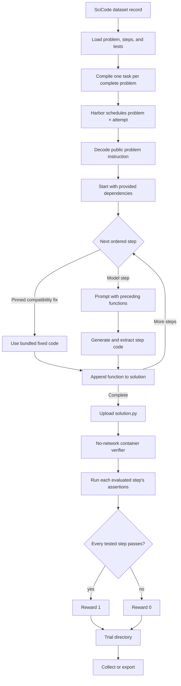

# SciCode pipeline

One SciCode task contains ordered function-writing steps. Later prompts include
the code accumulated from earlier steps, so generation inside a trial is
sequential even when Harbor runs different tasks concurrently.

The verifier executes each step in a separate isolated Python subprocess using
the official assertions and targets from `test_data.h5`. The complete problem
passes only when every evaluated step passes. SciCode has no static runner and
no Artificial Analysis submission stage.

Trajectory export emits one training sample per model-generated step. Bundled
fixed steps remain context, not training targets.

See the [SciCode guide](README.md) for commands and data setup.
